# AnonymousChatPOC

1️⃣ Architecture

```mermaid
graph TB
    %% ========== USER DEVICES ==========
    U1[📱 iOS Device]
    U2[📱 Android Device]
    
    %% ========== FRONTEND APP ==========
    subgraph "📱 Frontend: React Native + Expo"
        RN[Expo React Native App]
        EXPO_LOC[Expo Location API]
        EXPO_NOTIF[Expo Notifications]
    end
    
    %% ========== AUTHENTICATION ==========
    subgraph "🔐 Auth: Firebase Authentication"
        FIREBASE_AUTH[Firebase Auth<br/>Anonymous Login]
        FIREBASE_TOKEN[JWT Token Generator]
    end
    
    %% ========== REAL-TIME DATABASE ==========
    subgraph "💬 Database: Firebase Firestore"
        FIRESTORE_DB[Firestore Database]
        CHAT_ROOMS[Chat Rooms Collection]
        USER_PROFILES[User Sessions]
    end
    
    %% ========== LOCATION SERVICES ==========
    subgraph "📍 Location: Redis Cloud + PostGIS"
        REDIS[Redis Cloud<br/>GEO Commands]
        POSTGIS[PostgreSQL + PostGIS<br/>for Analytics]
    end
    
    %% ========== MAP SERVICES ==========
    subgraph "🗺️ Maps: Mapbox GL Native"
        MAPBOX[Mapbox Vector Tiles]
        MAPBOX_API[Mapbox Directions API]
    end
    
    %% ========== BACKEND API ==========
    subgraph "⚙️ Backend: AWS Lambda + API Gateway"
        API_GW[AWS API Gateway]
        LAMBDA_LOC[AWS Lambda<br/>Location Service]
        LAMBDA_MATCH[AWS Lambda<br/>Matching Service]
        LAMBDA_CHAT[AWS Lambda<br/>Chat Service]
    end
    
    %% ========== PUSH NOTIFICATIONS ==========
    subgraph "🔔 Push: Firebase Cloud Messaging"
        FCM[FCM Push Service]
        APNS[Apple Push Service]
    end
    
    %% ========== MEDIA STORAGE ==========
    subgraph "🖼️ Storage: AWS S3 + CloudFront"
        S3[AWS S3 Bucket]
        CLOUDFRONT[CloudFront CDN]
    end
    
    %% ========== MONITORING ==========
    subgraph "📊 Monitoring: AWS CloudWatch + Sentry"
        CLOUDWATCH[AWS CloudWatch]
        SENTRY[Sentry Error Tracking]
    end
    
    %% ========== CONNECTIONS ==========
    %% Users to App
    U1 --> RN
    U2 --> RN
    
    %% App to Services
    RN --> EXPO_LOC
    RN --> EXPO_NOTIF
    RN --> FIREBASE_AUTH
    RN --> MAPBOX
    
    %% Auth to API
    FIREBASE_AUTH --> API_GW
    
    %% API to Backend Services
    API_GW --> LAMBDA_LOC
    API_GW --> LAMBDA_MATCH
    API_GW --> LAMBDA_CHAT
    
    %% Backend to Databases
    LAMBDA_LOC --> REDIS
    LAMBDA_MATCH --> REDIS
    LAMBDA_CHAT --> FIRESTORE_DB
    
    %% Notifications
    LAMBDA_CHAT --> FCM
    FCM --> EXPO_NOTIF
    FCM --> APNS
    
    %% Media Storage
    RN --> S3
    S3 --> CLOUDFRONT
    
    %% Monitoring
    RN --> SENTRY
    API_GW --> CLOUDWATCH
    LAMBDA_LOC --> CLOUDWATCH
    
    %% Styling
    classDef frontend fill:#2196F3,color:white
    classDef auth fill:#FF9800,color:white
    classDef database fill:#4CAF50,color:white
    classDef location fill:#9C27B0,color:white
    classDef maps fill:#00BCD4,color:white
    classDef backend fill:#673AB7,color:white
    classDef notifications fill:#F44336,color:white
    classDef storage fill:#795548,color:white
    classDef monitoring fill:#607D8B,color:white
    classDef device fill:#FF5722,color:white
    
    class U1,U2 device
    class RN,EXPO_LOC,EXPO_NOTIF frontend
    class FIREBASE_AUTH,FIREBASE_TOKEN auth
    class FIRESTORE_DB,CHAT_ROOMS,USER_PROFILES database
    class REDIS,POSTGIS location
    class MAPBOX,MAPBOX_API maps
    class API_GW,LAMBDA_LOC,LAMBDA_MATCH,LAMBDA_CHAT backend
    class FCM,APNS notifications
    class S3,CLOUDFRONT storage
    class CLOUDWATCH,SENTRY monitoring
```



2️⃣ Real-time Communication Flow


3️⃣ Dynamic Radius-Based Matching Algorithm
```mermaid
flowchart TD
    Start[User enters app] --> GetLocation[Get current location]
    GetLocation --> UpdateLocation[Send to Location Service]
    
    UpdateLocation --> RedisStore[Store in Redis GEO<br/>GEOADD user:location]
    
    RedisStore --> TriggerMatch[Trigger Matching Service]
    
    TriggerMatch --> QueryRadius[Query users within radius]
    
    QueryRadius --> FilterActive[Filter active users<br/>last 5 minutes]
    
    FilterActive --> CheckBlocked[Remove blocked users]
    
    CheckBlocked --> SortByDistance[Sort by proximity]
    
    SortByDistance --> UpdatePresence[Update online presence]
    
    UpdatePresence --> NotifyNearby[Notify nearby users]
    
    NotifyNearby --> CreateRooms[Create/Update chat rooms]
    
    CreateRooms --> SendInvites[Send chat invitations]
    
    SendInvites --> DisplayUsers[Display nearby users in app]
    
    DisplayUsers --> UserSelection{User selects<br/>chat option}
    
    UserSelection -->|Group Chat| JoinGroup[Join radius group chat]
    UserSelection -->|1-on-1 Chat| CreatePrivate[Create private chat]
    
    JoinGroup --> GroupMessages[Exchange group messages]
    CreatePrivate --> PrivateMessages[Exchange private messages]
    
    GroupMessages --> UpdateActivity[Update user activity]
    PrivateMessages --> UpdateActivity
    
    UpdateActivity --> Loop[Loop every 30s]
    Loop --> GetLocation
    ```
